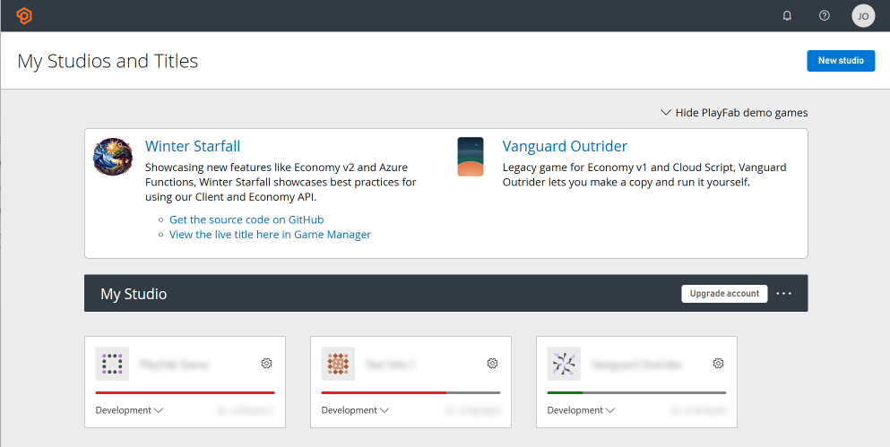

# Demo game: Vanguard Outrider (legacy)

Vanguard Outrider is a game previously created by the PlayFab team for customers to try out. It is available through Game Manager alongside Winter Starfall. We recommend referring to Winter Starfall for the most accurate example of our current feature set and best practice guidelines, and look at Vanguard Outrider as an additional resource for testing out PlayFab.

You can find Vanguard Outrider in the demo games dropdown on the Studios & Titles overview in Game Manager.

Vanguard Outrider is different from Winter Starfall in that it requires an empty PlayFab title to populate with data, which you can create after [signing up for a free PlayFab account](https://developer.playfab.com/sign-up).

## Legacy features

The features that run on legacy versions in Vanguard Outrider are:

- [Legacy Economy](../features/economy/quickstart.md)
- [Legacy CloudScript](../features/automation/cloudscript/index.md)

## See also

- [Play Vanguard Outrider](http://vanguardoutrider.com/)
- Download [Vanguard Outrider source code](https://github.com/PlayFab/vanguard-outrider)

> [!NOTE]
> Running a local version of Vanguard Outrider requires a credit card to run the legacy economy features.
