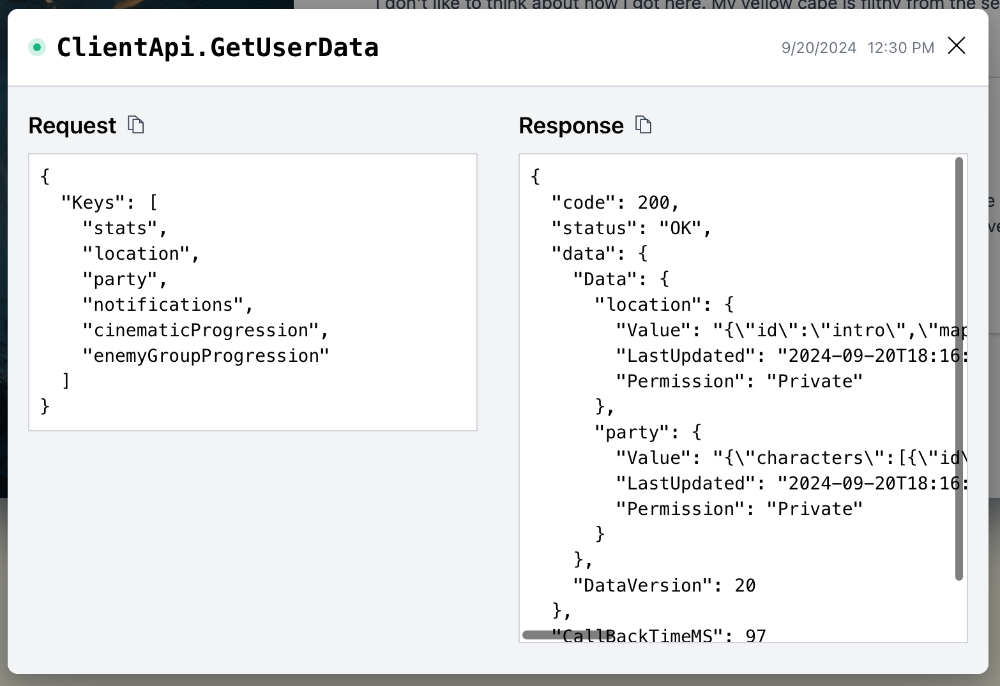

# Demo game: Winter Starfall

Winter Starfall is a game developed by PlayFab to make it easier to explore our different features.

The game is built as a web app and uses APIs from the PlayFab SDK [link] to use PlayFab features, along with PlayFab’s Azure Functions integration.
To try it out, create a PlayFab account and find the game in the demo studio.
The game makes use of the following features:

- Economy V2 (catalog, currency, bundles, stores)
- Title data, player data, and other core PlayFab functions
- Title news for communicating with players
- CloudScript with Azure Functions

## Demo features

Winter Starfall comes with some features that make it easier to see what is going on ‘under the hood’ with PlayFab. The game is available for anyone to play, but to get the full use of these features you’ll need to sign up for a [free developer account](link). 

Next to the profile icon in the upper right there is a PlayFab icon that will open the PlayFab activity sidebar when clicked.


1. The activity sidebar shows a list of API calls that updates as you play the game. 
1. You can select one of the API calls in the list to view the full API request and response.
1. Selecting **View title F8941** will open the title in Game Manager, the developer portal, where you can see how the different features are configured. This is where you'll be prompted to sign in with a PlayFab developer account.
1. **Clear** will remove all the current notifications from the activity bar. 

You’ll also notice throughout the game these various PlayFab logos [or other callouts]. Each of these indicates where a specific PF feature is used to power a certain aspect of the game and hovering over will show more information and take you to the related pages in Game Manage.

[screenshot - callouts]

> [!NOTE] 
> You can play the demo game at any time, but to access Game Manager you’ll need to sign up for a [free developer account](link]).


## Included PlayFab features

The following section breaks down in more detail the different PlayFab features that are used in the game.

### Authentication

The first thing that happens in a PlayFab game is logging in a player. The [source code and scenarios tutorial](source-code-and-best-practices.md) gives an in depth walkthrough of the login flow. 

Learn more about PlayFab Authentication [here](../features/authentication/login/index.md).

### Economy

PlayFab’s economy APIs handle everything related to player inventory, purchasing items in the game
Catalog –  items, currency, stores, bundles (rewards for completing battles)

Learn more about Economy V2 [here](../features/economy-v2/overview.md).

### Player data 

Player data is a core part of PlayFab that allows you to store player-related information in key/value pairs or objects and files that can be shared across multiple games and devices. In Winter Starfall, player data is used to store the game state and other player specific information such as their inventory. When the player moves through the story, their position is recorded in their player profile through a call to the UpdateUserData API.



API Request - GetUserData
```json
{
  "Keys": [
    "stats",
    "location",
    "party",
    "notifications",
    "cinematicProgression",
    "enemyGroupProgression"
  ]
}
```
API Response - GetUserData
```json
{
  "code": 200,
  "status": "OK",
  "data": {
    "Data": {
      "location": {
        "Value": "{\"id\":\"intro\",\"map\":[\"intro\",\"intro-village\"]}",
        "LastUpdated": "2024-09-20T18:16:13.68Z",
        "Permission": "Private"
      },
      "party": {
        "Value": "{\"characters\":[{\"id\":1,\"armor\":\"dfae3ef9-92a0-493b-9bb8-f88a09718d26\",\"weapon\":\"32e1f684-43b0-4fe6-982e-b0829ff0d6f3\",\"spells\":null}],\"guests\":[]}",
        "LastUpdated": "2024-09-20T18:16:13.68Z",
        "Permission": "Private"
      }
    },
    "DataVersion": 20
  },
  "CallBackTimeMS": 97
}
```
Learn more about Player data [here](../features/playerdata/index.md). 

Player Data Management - Update User Data - REST API (PlayFab Admin) | Microsoft Learn

### Title data

Used in player login. Also used in conjunction with Economy to store a ‘multiplier’ used to calculate the price when a player sells an item

### CloudScript with Azure Functions

CloudScript is another key part of making this game work, because its a very flexible feature that allows you to enables serverless compute on demand 

request execution of any custom server-side functionality you can implement, and it can be used in conjunction with virtually anything.

Vanguard Outrider runs CloudScript functions in C#, but y can use any language supported by Azure Functions [
Supported languages in Azure Functions | Microsoft Learn ] 

CloudScript functions are used to 
For example, in this case the CloudScript function ‘ProgressCheckpoint’ is executed after the player wins a battle, updating the character’s stats, location, items gained/used, etc.

[use code snippet to demonstrate how this azure function updates player data] vanguard-outrider-2/azure-functions/ProgressCheckpoint.cs at main · PlayFab/vanguard-outrider-2 (github.com)
ProgressCheckpoint makes calls to the economy APIs

In the activity stack, 
[screenshot of API call]
[copy of API request and response]

Learn more about CloudScript with Azure Functions [here](../features/automation/cloudscript-af/index.md).

### Title news

Title news is used to communicate to all players scoped to a title – gameplay tips and notices. Additional capabilities such as using player segments to send messages to specific subsets of players, and Experimentation to A/B test with different messaging


In addition to title news, PlayFab offers other communication features like templating for email and push notifications. Learn more about title communication methods [here](../features/engagement/overview.md).

## Demo limitations

Because Winter Starfall is powered by real player data, some features are limited in scope in the Game Manager view. To explore these pages in more detail, you can [download the source code](link) and run a local instance of the game, or create your own title [link to get started/logging in a player tutorial].

The limited pages include:

- Players page and overview
- Data Explorer

Player data in Vanguard Outrider

[screenshot - Sample of player overview (inventory, information, etc)]

Data Explorer and analytics features

[screenshot of sample]

Learn more [here] / download source code to try these features [tutorial]

## See also

- Try the game at [link](here)
- Learn more about [Game Manager](link)
- Learn about Entity model
- Tutorial - source code
- Other demos – recipes and samples
- Learn about SDK
