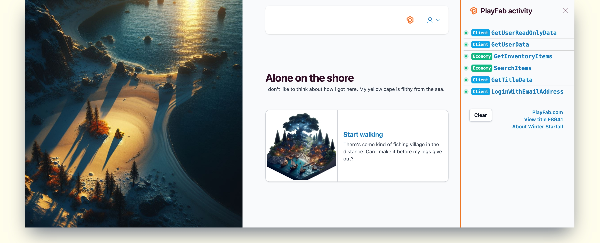
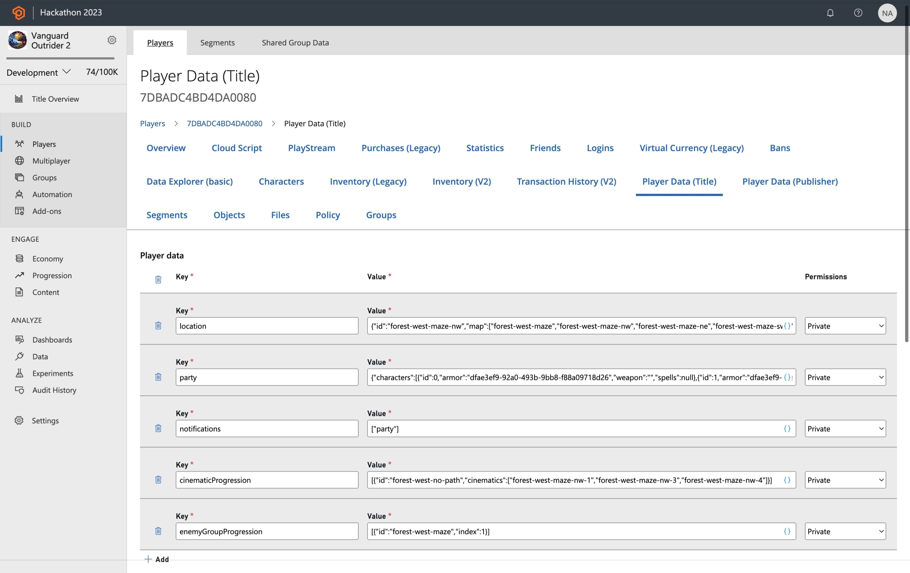
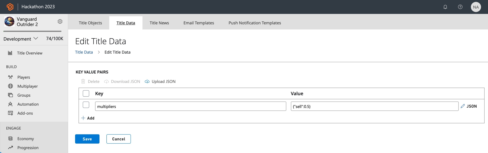
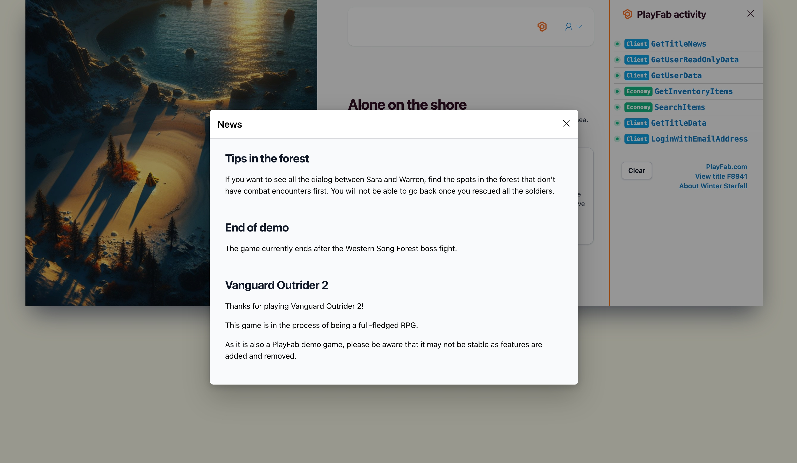

# Demo game: Winter Starfall

Winter Starfall is a game developed by PlayFab to showcase our different features and provide a way to explore how they are implemented in a live game.

The game is available to play [here](link). If you already have a PlayFab developer account you can also access it through the developer portal on the Studios & Titles overview.

![studios overview demo games]

The game is built as a web app and uses APIs from the PlayFab SDK [link] along with PlayFab’s Azure Functions integration to implement custom functionality. The game currently makes use of the following PlayFab features:

- Economy V2 (catalog, currency, bundles, stores)
- Title data, player data, and other core PlayFab functions
- Title news for communicating with players
- CloudScript with Azure Functions

## Additional demo features

Winter Starfall comes with some features that make it easier to see what is going on ‘under the hood’ with PlayFab. The game is available for anyone to play, but to get the full use of these features you’ll need to sign up for a [free developer account](link). 

Next to the profile icon in the upper right there is a PlayFab icon that will open the PlayFab activity sidebar when clicked.



1. The activity sidebar shows a list of API calls that updates as you play the game. Each API call is tagged and color coded to indicate which PlayFab SDK it is related to.
1. You can select one of the API calls in the list to view the full API request and response.
1. Selecting **View title F8941** will open the title in Game Manager, the developer portal, where you can see how the different features are configured. This is where you'll be prompted to sign in with a PlayFab developer account.
1. **Clear** will remove all the current notifications from the activity bar. 

<!---
You’ll also notice throughout the game these various callouts. Each of these indicates where a specific PlayFab feature is used to power a certain aspect of the game and hovering over will show more information and take you to the related pages in Game Manager.

[screenshot - callouts]
--->

> [!NOTE]
> You can play the demo game at any time, but to access Game Manager you’ll need to sign up for a [free developer account](link]).

## Included PlayFab features

The following section breaks down in more detail the different PlayFab features that are used in the game.

### Authentication

The first thing that happens in any PlayFab game is logging in a player, which returns an authentication token that is required for all subsequent API calls. Winter Starfall supports multiple forms of recoverable login with email, Google, and Facebook. The [source code and scenarios tutorial](source-code-and-best-practices.md) gives an in depth walkthrough of the login flow and best practices for player authentication.

Learn more about PlayFab Authentication [here](../features/authentication/login/index.md).

### Economy

As a fantasy RPG style game, Winter Starfall includes an economy system for the player to visit stores, purchase items, earn currency, and more. PlayFab’s newest economy service handles everything related to inventory and commerce in the game. The [source code and scenarios tutorial](source-code-and-best-practices.md) gives an in depth walkthrough of the purchase flow that occurs in the game.

Learn more about Economy V2 [here](../features/economy-v2/overview.md).

### Player data

Players in PlayFab have associated data that is stored in the service by different features. Player data as a feature allows you to store player-related information in key/value pairs or objects and files that can be shared across multiple games and devices.

In Winter Starfall, Player data is used to store the game state and information like which characters have joined the player's party. When the player moves through the story, their position is recorded in their player profile through a call to the UpdateUserData API[xref api docs]. This data is then accessed with GetUserData when they log in, to load the player into the right point in the story with all their past progress.



For example, these are the API request and response body from the call to `GetUserData` during the login flow. 

API Request - GetUserData
```json
{
  "Keys": [
    "stats",
    "location",
    "party",
    "notifications",
    "cinematicProgression",
    "enemyGroupProgression"
  ]
}
```
API Response - GetUserData
```json
{
  "code": 200,
  "status": "OK",
  "data": {
    "Data": {
      "location": {
        "Value": "{\"id\":\"intro\",\"map\":[\"intro\",\"intro-village\"]}",
        "LastUpdated": "2024-09-20T18:16:13.68Z",
        "Permission": "Private"
      },
      "party": {
        "Value": "{\"characters\":[{\"id\":1,\"armor\":\"dfae3ef9-92a0-493b-9bb8-f88a09718d26\",\"weapon\":\"32e1f684-43b0-4fe6-982e-b0829ff0d6f3\",\"spells\":null}],\"guests\":[]}",
        "LastUpdated": "2024-09-20T18:16:13.68Z",
        "Permission": "Private"
      }
    },
    "DataVersion": 20
  },
  "CallBackTimeMS": 97
}
```

Learn more about the Player data feature [here](../features/playerdata/index.md). 

### Title data

Title data is similar to Player data in that it stores key-value pairs, only the data pertains to the game title instead of a specific player. Winter Starfall uses title data in conjuction with the Economy system to calculate the price when selling an item by storing the value `multipliers` with a value of `sell, 0.5`. For more information on how the sale flow works, see the [source code and scenarios tutorial](source-code-and-best-practices.md).



Learn more about Title data [here](../features/titledata/index.md).

### CloudScript with Azure Functions

CloudScript is a very flexible feature that allows you to implement custom server-side fucntionality, which allows for nearly limitless solutions when paired with other PlayFab features.

The game uses this feature to solve for a number of scenarios:

- [CombatVictory](https://github.com/PlayFab/vanguard-outrider-2/blob/main/azure-functions/CombatVictory.cs) - After the player wins a battle, execute a series of actions to grant exp, items, and add party members.
- [PlayerCreated](https://github.com/PlayFab/vanguard-outrider-2/blob/main/azure-functions/PlayerCreated.cs) - Equips a new player with starting items and stats.
- [ProgressCheckpoint](https://github.com/PlayFab/vanguard-outrider-2/blob/main/azure-functions/ProgressCheckpoint.cs) - Performs actions to unlock items and characters after reaching key story points.
- [ResetPlayer](https://github.com/PlayFab/vanguard-outrider-2/blob/main/azure-functions/ResetPlayer.cs) - Wipes user data, items, and statistics for a full reset.
- [SellItem](https://github.com/PlayFab/vanguard-outrider-2/blob/main/azure-functions/SellItem.cs) - Enables selling items at a discount, which is not an inherent feature of the economy system. The purchase/sale flow is covered in more detail in the [source code and scenarios tutorial](source-code-and-best-practices.md).

Learn more about CloudScript with Azure Functions [here](../features/automation/cloudscript-af/index.md).

> [!NOTE]
> Winter Starfall's CloudScript functions are written in C#, but you can use any language supported by [Azure Functions](https://learn.microsoft.com/azure/azure-functions/supported-languages?tabs=isolated-process%2Cv4&pivots=programming-language-csharp).

<!---
PlayerCreated best practices - check that player is actually new and as not recieved anything

In the activity stack, 
[screenshot of API call]
[copy of API request and response]

```json
{
  "FunctionName": "CombatVictory",
  "FunctionParameter": {
    "party": {
      "characters": [
        {
          "id": 1,
          "hp": 5,
          "maxHP": 35,
          "mp": 3,
          "maxMP": 8,
          "level": 1,
          "xp": 0,
          "attack": 1,
          "defense": 1,
          "available": true,
          "xpToNextLevel": 100,
          "xpToCurrentLevel": 0
        }
      ]
    },
    "itemsUsed": {
      "f1047f02-b03b-43c6-befd-f3d0cc07cf91": 1
    },
    "xpEarned": 30,
    "reward": ""
  }
}
```

```json
{
  "code": 200,
  "status": "OK",
  "data": {
    "ExecutionTimeMilliseconds": 944,
    "FunctionName": "CombatVictory",
    "FunctionResult": {
      "itemsGranted": [],
      "characters": [
        {
          "id": 1,
          "hp": 5,
          "maxHP": 35,
          "mp": 8,
          "maxMP": 8,
          "level": 1,
          "xp": 30,
          "attack": 1,
          "defense": 1,
          "available": true,
          "xpToNextLevel": 100,
          "xpToCurrentLevel": 0
        }
      ]
    }
  },
  "CallBackTimeMS": 1090
}
```
--->

### Title news

Title news is used to communicate with all players scoped to a title. Winter Starfall implements it as a notification system to display gameplay tips and notices. Additional capabilities such as using player segments to send messages to specific subsets of players, and Experimentation to A/B test with different messaging



In addition to title news, PlayFab offers other communication features like templating for email and push notifications. Learn more about title communication methods [here](../features/engagement/overview.md).

## Demo limitations

Because Winter Starfall is powered by real player data, some features are limited in scope in the Game Manager view. This section will give an overview of what the limited features would look like in Game Manager. To explore these pages in more detail, you can [download the source code](link) and run a local instance of the game, or create your own new title from scratch.

> [!NOTE]
> For a full guide to the features in the developer portal, see the [Game Manager documentation](../gamemanager/index.md).

### Players

The **Players** section of Game Manager is hidden in the Winter Starfall title in order to protect player information. Usually, you would be able to query the entire list of players in your game and select an individual account to update their data through Game Manager. From the player overview page you can view all information related to the player including inventory items, a record of all logins, player data, and more.

[screenshot - Sample of player overview (inventory, information, etc)]

### Data & Analytics

Some of the features under the **Analyze** section are also limited to protect title and player information. This includes 

[screenshot of regular sidebar with missing sections highlighted]

#### Data

[screenshot of sample query and reports]

#### Audit history

Audit history gives a view into the history of changes made to the title by anyone with edit access. 

See the [audit logs documentation](../gamemanager/audit-logs.md) for more information.

Also see the Data & Analytics documentation for more information on these features.

### Other

Under title settings, the **Secret keys** tab is hidden.  Documention for secret key managment is available [here](../gamemanager/secret-key-management.md).


## Next steps

After trying the demo, we recommend starting with these topics to learn more about how PlayFab works:
- Learn more about [Game Manager](link)
- Learn about Entity model
- Other demos – recipes and samples
- Learn about SDK

## See also

- [Play Winter Starfall](here)
- [Tutorial: Download source code and example flows](source-code-and-best-practices.md)